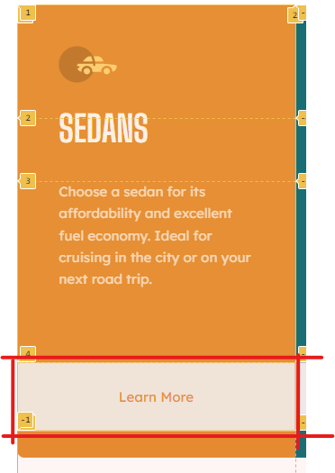

# Frontend Mentor - 3-column preview card component solution

This is a solution to the [3-column preview card component challenge on Frontend Mentor](https://www.frontendmentor.io/challenges/3column-preview-card-component-pH92eAR2-). Frontend Mentor challenges help you improve your coding skills by building realistic projects. 

## Table of contents

- [Frontend Mentor - 3-column preview card component solution](#frontend-mentor---3-column-preview-card-component-solution)
  - [Table of contents](#table-of-contents)
    - [The challenge](#the-challenge)
    - [Effort Estimation ~ 8 hours](#effort-estimation--8-hours)
    - [Actual Effort ~ 3 hours](#actual-effort--3-hours)
    - [Estimation Debrief](#estimation-debrief)
    - [Screenshot of Solution](#screenshot-of-solution)
    - [Links](#links)
  - [My process](#my-process)
    - [Built with](#built-with)
    - [What I learned](#what-i-learned)
    - [Continued development](#continued-development)
    - [Useful resources](#useful-resources)
  - [Author](#author)


### The challenge

Users should be able to:

- View the optimal layout depending on their device's screen size
- See hover states for interactive elements

### Effort Estimation ~ 8 hours 
I anticipate this challenge should take ~8 hours of dedicated effort. This estimate includes development and research in order to get a working product, I will try to balanch coding standards with getting a developed product. I will save intense adherance to markup best practices for a mock code review of myself and that will be counted as a separate effort.

I will be doing the project with raw HTML 5 and CSS 3 there will be no use of front-end frameworks. 

### Actual Effort ~ 3 hours
This section will detail the actual effort I contributed to the project, number of pomodoros, date and time stamps of sessions so I can get as close as possible to estimating total deep work time.

**4/13/2021**
- (4) 25 minute pomodoros with 5 minute rest attached (2 hours total)

**4/14/2021**
- (3) 25 minute pomodoros with 5 minute rest attached (1.5 hours total)

### Estimation Debrief 
A hell of an overestimation. I had never used solely CSS Grid before to this degree and truth be told I was compensating for a habit I have of getting stuck in analysis paralysis. I tend to go into documentation trying to find a full understanding of a technology instead of pulling relevant pieces to get something working. I'm proud of myself for sticking to productive Pomodoros in which my main objective was to get working markup on to the page. The original estimation took into account ideas such as, clean code, semantic HTML and accurate naming of HTML element classes and ID's using the BEM naming methodology.

### Screenshot of Solution


### Links

- Solution URL: [Check out the Github Repo!](https://github.com/justcodebruh/car-rental-card-components)
- Live Site URL: [Check it out here!](https://justcodebruh.github.io/car-rental-card-components/)

## My process
I started off with the plain text that the challenge already came with and followed the methodology suggested in the challenge README:
  1. Solidify your layout using HTML Markup & CSS
  2. Apply styling from the top to the bottom

I began by creating the layout by relying solely on the CSS Grid Layout  to position all elements on the page. I made an effort to avoid flexbox since I already have experience with it and wanted to push myself to become  more comfortable with CSS Grid Layout. 

In the desktop view I borrowed the pixel dimensions of the entire card component from the Figma document and made that the deault row size (921px) and used the same strategy for generating the column sizes.

I continued to use CSS grid to organize the HTML elments within each card. I tweaked the size of each row after implementing styling for each of the HTML elements, making sure to  match the mockup dimensions as closely as possible. I didn't go through the trouble of finding the exact pixel measurements between HTML elements. ***(I would love some input here as to whether that was a good or bad choice and why).***

### Built with

- Semantic HTML5 markup ***(To the best of my ability, please input if there more descriptive elements that can be used anywhere)***
- CSS3 Stylesheet
- CSS Grid Layout

### What I learned

I focused my learning on CSS Grid. A key takeway was the fact that CSS Grid will "automagically" generate rows  based on the child HTML elements in the parent element that is set to ```display: grid```. 

For example, if you specify four rows for and one column for a parent element that has four child elements stacked on top of one another. CSS Grid will assign each of the child elements to their own row.

I noticed this behavior when my button element become a huge square at the bottom of each of my indivdual cards (Sedan, SUV, and Luxury). 


The logo for each of the cards was placed in it's own row, the heading of the card ```<h1></h1>``` was within it's own row, the advertising copy within the paragraph ```<p></p>``` was within it's own row, and then that left my unstyled (at the time time) button to fill the bottom row.


This particular revelation let me know that HTML elments within a particular row will fill out to the size of the specified CSS Grid cell that they fall in. This point was further driven home when I used the Chrome Dev Tools to inspect the CSS Grid also seen in the screenshot above (How to do that is listed under [Useful Resources](#useful-resources)). 

### Continued development

I would like to try and make the page fully responsive by including a tablet view and making the entire card component expand to fill whatever viewport it inhabits.

### Useful resources

- [Chrome Dev Tools: CSS Grid Inspection](https://developer.chrome.com/docs/devtools/css/grid/) - Chrome Dev Tools continues to show itself as a beautifully crafted swiss army knife for web development. The ability to visually see the CSS Grid in real-time allowed me to quickly lookup the proper documentation for grid property values and try them out before officially adding them to the stylesheet.
- [Blog Post](https://www.crimsondesigns.com/blog/smooth-strides-from-css-to-css3/3/) - This blog post that introduced me to the term "CSS Order of Precedence". I had previously learned about the concept through example but did not know there was a proper term. I ran into this article when trying to troubleshoot my mobile view media query which I initially placed at the top of my stylesheet.


## Author

- LinkedIn - [Alex J.](https://www.linkedin.com/in/alexjeanb/)
- Frontend Mentor - [@justcodebruh](https://www.frontendmentor.io/profile/justcodebruh)
- Twitter - [@justcodebruh](https://www.twitter.com/justcodebruh)


